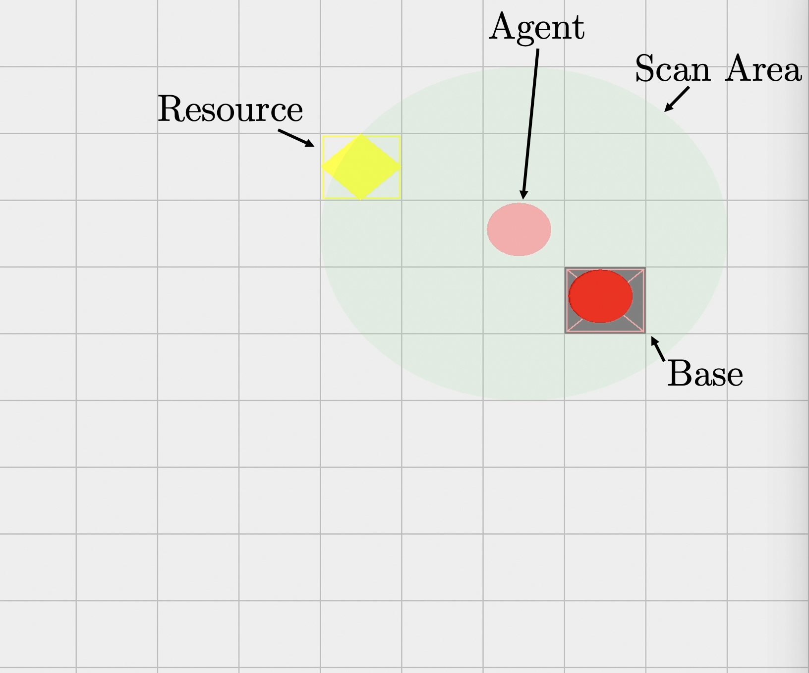
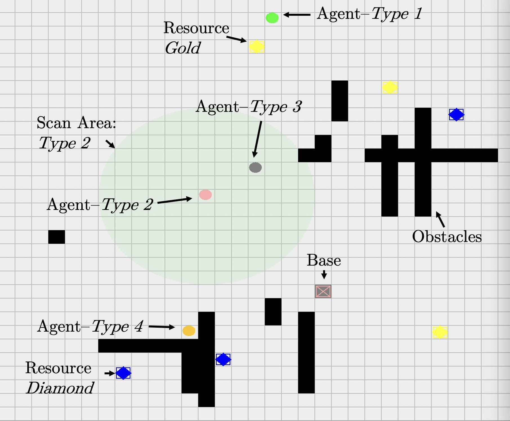

# Description
Rovers must explore unknown terrains in search for precious Mars materials (gold and diamonds). With finite energy, efficient search and collection routes are imperative. This repository contains one approach to the aforementioned problem. Built using JASON, Agentspeak and Java coding languages, rover agents collaborate to overcome various challenges across multiple environments.

[AgentSpeak](https://en.wikipedia.org/wiki/AgentSpeak) is an agent-oriented programming language. It is based on logic programming and the belief–desire–intention software model (BDI) architecture for (cognitive) autonomous agents. 

# High Level Description
Agent (pink) starts at base (grey square) with a finite number of energy points and a specific scan area (transparent green circle). When resources are found (gold: yellow, diamond: blue), they are collected and transported back to the base before the energy runs out. 

Both moving and scanning cost energy so it is imperative to make efficient use of each action. By remembering which regions have been scanned, and communicating with other allied agents, the most efficient approach is achieved.

# Video Outputs

# Getting started with JASON & Agentspeak
Development setup for JASON & Agentspeak requires the following configurations:
1. Java JDK [_click_here_](https://www.oracle.com/java/technologies/javase-jdk15-downloads.html)
2. Install Eclipse IDE [_click here_](https://www.eclipse.org/downloads/)
3. Install JASON [_click here_](https://sourceforge.net/projects/jason/files/jason/version%202.4/jason-2.4.zip/download)
4. Install JASON eclipse plugin [_click here_](http://jason.sourceforge.net/mini-tutorial/eclipse-plugin/)
5. After install, in Eclipse: Right Click on Project > Build Path > Configure Build Path > Add External Jars... > Replace the Jars in directory showing errors

(_Note: The versions in provided links are the same as for the presented works._)

# Rover Environment Description
_Credit to Fahid Mohammed, [@fahidRM](https://github.com/fahidRM) for creating the testing environment and project description below..._

## Contents
 - [The Environment](#env)
 - The Agent
   - [Agents actions within the environment](#awe)
     - [Scan](#scan)
     - [Move](#move)
     - [Collect](#collect)
     - [Deposit](#deposit)
  - [Action Feedback](#act_feed)
       - All Actions
            - [action\_completed\_feedback](#a_c_feed) 
            - [insufficent\_energy\_feedback](#i_e_feed) 
            - [invalid\_action\_feedback](#i_a_feed) 
       - Specific Feedback: Scanning
            - [resource\_not\_found\_feedback](#r_n_f_feed) 
            - [resource\_found\_feedback](#r_f_feed) 
       - Specific Feedback: Moving
            - [obstructed\_feedback](#m_o_feed) 
   - [Extending agents capabilities using Internal actions](#eac)
      -  [get\_energy](#gre)
      -  [Important note & provisional internal actions](#pia)
 - [Making your own maps](#making_maps)

## The Environment

The `RoverWorld` environment is provided as a component of the `jason-rover-environment.jar` file.
To use this environment, set the `environment` entry of your `mas2j` file to: 

   __ `environment: rover.RoverWorld("mas2j_file=<mas2j_file_name>", "scenario_id=<scenario_id>")`__
where;

**_mas2j\_file_**: Name of mas2j file or its path if it's located elsewhere.

**_scenario_id**: An string representing the id of the scenario to load.

example;
__`environment:    rover.RoverWorld("mas2j_file=scenario_1.mas2j", "scenario_id=graded-scenario-1")`__

_**NOTE**: This has already been done for you in the attached `mas2j` files_

## Agents
Agents are loaded via the mas2j file and each agent is expected to be configured before connecting to the environment.
Configuring an agent involves specifying its `capacity`, `scan_range` and where necessary `resource_type`.

You have **6** points to share between `capacity` and `scan_range`.

i.e. `capacity` can not have a value below 0 or above 6 and where `capacity` is 6,   `scan_range` must be 0.

The environment would confirm all agent configurations are valid. Where a violation is detected, an adequate error message would be displayed and the affected agent(s) would be reconfigured as follows: 

`capacity = 3 and scan_range = 3`

Adding an Agent to the environment requires the following line to be present in your coursework's mas2j file(s);

__`agents: <agent_name> [capacity=< val >, scan_range=< val >"] #< instances >;`__

where;

__*agent_name*__: Name of agent to add. This is the same name as the Agent's `.asl` file

__*instances*__:  A positive non-zero integer that specifies the instances of that agent to add to the environment. 

example;
__`dummy_bot [capacity=3, scan_range=3] #1;`__

In this example, one instance of the agent `dummy_bot` defined in the file `dummy_bot.asl` would be added into the environment. It would have a capacity of 3 and a scan range of 3.

In certain scenarios, there would be multiple resource types available on the map (Gold & Diamond). Agents may only collect resources of a particular type and this can be specified in the mas2j file. Where unspecified, the type of the first resource collected by the agent would be the only type it can collect.

To specify resource type, add the `resource_type` attribute to the agent declaration as shown below;

example;
__`dummy_bot [capacity=3, scan_range=3, resource_type="gold"] #1;`__

The available options are `Gold` and `Diamond`. 

### Agents actions within the environment
Within the environment, an Agent would be able to `scan` the map, `move` around the map, `collect` resources and `deposit` collected resources. 

All actions  cost energy and would result in a feedback indicating the success or failure fo the action execution which would be delivered to agents in the form of `percepts`.

__Note:__ Staying idle also costs energy.

Below are the syntax for the above stated actions;

`scan:  scan(<scan_range>)`

    Example: scan(3) 
    Example note: This would allow an Agent scan the map with a scan range of 3

`move: move(<x-displacement>, <y-displacement>)`

    Example:  move(3, 3)
    Example note: This would allow an agent to move 3 steps away from its current possition along the x-axis and 3 steps away from its current position along the y-axis.
    
    More info:
    x-displacement:- Distance away from current position to travel along the x-axis
    y-diaplacement:- Distance away from current position to travel along the y-axis
    
`deposit: deposit(<resource_type>)`

    Example: deposit("gold")
    Example note: This would allow an Agent to deposit a gold resource it's currently holding on the map.
    
`collect: collect(<resource_type>)`

    Example: collect("gold")
    Example note: Collects a single resource of the specified type from the map. 
    Kindly note that making an agent collect("gold") at one time and collect("diamond") at another would not 
    enable it to collect both. While running, an agent may only pick one type of resource.

###  Action Feedback

####  All actions
Performing any of the allowed actions (`move`, `collect` and `deposit`) may result in any of the following feedback

#####  1. action completed feedback:
When an Agent successfully performs an action, a feedback is returned to inform it of the success.

    Format: action_completed(<action_name>);
    Example: action_completed(move);
    Example note: Informs the agent that it has successfully moved.

#####  2. insufficient energy feedback:
    
Insufficent energy feedback is returned when an Agent did not have sufficient energy to complete the action it just attempted. An insufficient energy feedback is a sign of action execution failure.

    Format:insufficient_energy(<action_name>);
    Example: insufficient_energy(move);
    Example note: Infroms the agent that it was unable to move due to insufficient energy.
    
#####  3. invalid action feedback:
When an Agent attempts to perform an action that has not been properly specified or an action that is not permitted within the environment, a failure feedback is returned indicting the invalid action. 

    Format: invalid_action(<action_name>, <reason>);
    Example: invalid_action(jump, unpermitted);
    Example note: Informs the agent that the action jump is not permitted in the environment. 
    
The three possible reasons are `unpermitted`, `invalid_param` and `unmet_requirement`

The `unpermitted`reason informs us that the an Agent is trying to perform an action that is not permitted in the environment. 

The `invalid_param` reason informs us that an invalid parameter was passed to an action. For instance trying to move with a non-numberic coordinate. 

The `unmet_requirement` reason informs us that a requirement to perform the stated action has not been met. For instance, an agent trying to deposit a resource when it does not have any or when it has not be configured to carry a resource.

    
__Note:__ An invalid action feedback would be raised for known action types in the following events;

##### __- scan__: If the Agent does not have the ability to scan or tries to scan an invalid range such as ` a negative range` or `a non numeric range`.

##### __- move__: If the Agent does not have the ability to move or tries to move to an invalid location (`non numeric coordinate`).

##### __- collect__: If the Agent tries to collect resource from a tile that has no resoure or if the Agent has no space to carry another resource.

##### __- deposit__: If the Agent tries to deposit when it is not carrying a resource. 

#### Specific Feedback: Scanning

#####  1. resource\_not\_found feedback:
If an Agent scans and doesn't find any resource, a resource\_not\_found feedback is returned. 

    Format: resource_not_found
    Example: resurce_not_found
    Example note: An agent scanned a portion of the map and found nothing.

#####  2. resource\_found feedback:
If an Agent scans a portion of the map and finds one or more resources.

        Format:  resource_found(<artefact_type>, <artefact_qty>, <x_dist>, <y_dist>)
        
where;

__*artefact_type*__: Item found on map such as `"Gold"`, `"Diamond"` or `"Obstacle"`.

__*artefact_qty*__: The qty found at that location.

__*x_dist*__: Artefact distance away from agent on the x-axis.

__*y_dist*__: Artefact distance away from agent on the y-axis.

        Example: resource_found("Gold",10,1,1)
        Example note: The Agent found 10 deposits of gold 1 step away on the x-axis and 1 step away on the y-axis.

#### Specific Feedback: Moving

#####  1. obstructed feedback:
If an Agent runs into another Agent on it's way, this would result in an `obstructed` feedback 

    Format: obstructed(<x_travelled>,<y_travelled>,<x_left>, <y_left>)

where;

__*x_travelled*__: Distance travelled along the x-axis before the collission.
    
__*y_travelled*__: Distance travelled along the y-axis before the collission.

__*x_left*__: Distance from destination along the x-axis.

__*y_left*__: Distance from destination along the y-axis.

    Example: obstructed(1,1,3,4)
    Example note: The Agent successfully travelled 1 step on both its x and y axis and the distance away from its initial destination is 3 steps away on the x-axis and 4 steps away on the y-axis.

   
   
### Extending the capability of Agents

Apart from the actions listed above, an Agent may extend its capability via internal actions.
Some internal actions have been provided for you such as;

#### *check\_status*: 
- usage:  __*rover.ia.check\_status(X)*__

This would store the Agent's current energy of type double in the variable X. 

__NOTE__: For this coursework, you are limited to create internal actions for navigation purposes only. A very basic implementation of this has been made available in the `libs/jason-rover-environment.jar` jar file under the package `rover.ia`. This implementation is made available to get you started and is not optimised __(unsuitable for submission)__. These internal actions would be demonstrated during the lab sessions and are briefly discussed below;

- __*log_movement*__: Keeps track of movement made by the Agent.
    `usage: rover.ia.log_movement (Xdist, Ydist)`
- __*clear_movement_log*__: Clears the map the Agent built.
        `usage: rover.ia.clear_movement_log`
- __*get_distance_from_base*__: Retrieves the location of the base.
       `usage: rover.ia.get_distance_from_base(Xdist,Ydist)`
       For `get_base_location` to work, all movements performed by an agent needs to be logged using the `log_movement` internal action.
       Note: this is not optimised and you will have to either implement yours or optimise the output you've gotten from this. 
- __*get_config*__: Retrieves the agent's configuration (capacity,  scan range and preferred resource type)
        `usage: rover.ia.check_config(Capacity,Scanrange,Resourcetype)`
- __*get_map_size*__: Retrieves the map's size as (Width, Height)
    `usage: rover.ia.get_map_size(Width,Height)`

### Making your own map
Custom maps allow you to test your agents' performance under certain conditions. To create custom maps, use the browser based tool available [here](https://github.bath.ac.uk/Intelligent-Agents/rover-world-map-builder). 